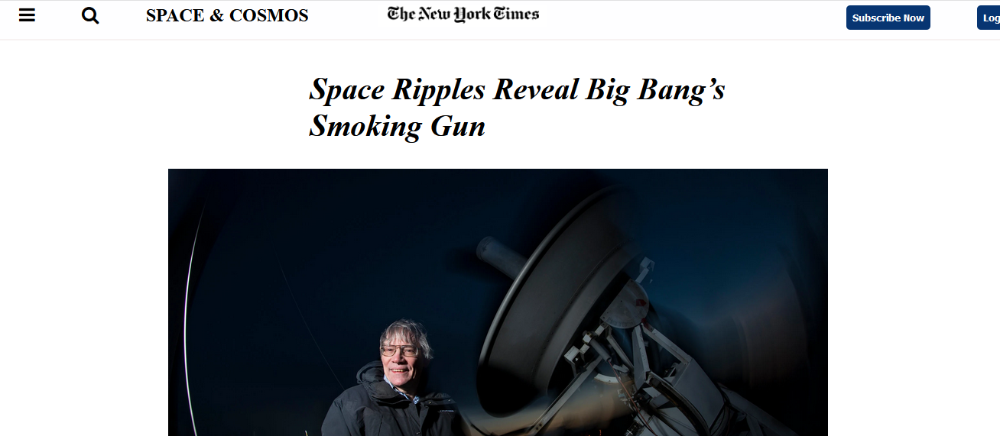

# Positioning and floating

A New York Times webpage replicate

```html
<pre>
    <div class="container">
        <div class="block two first">
            <div class="wrap">
                
            </div>
        </div>
    </div>
</pre>
```
Built With
Major languages
Frameworks
Technologies used
Live Demo
Live Demo Link

Getting Started
This is an example of how you may give instructions on setting up your project locally. Modify this file to match your project, remove sections that don't apply. For example: delete the testing section if the currect project doesn't require testing.

To get a local copy up and running follow these simple example steps.

Prerequisites
Setup
Install
Usage
Run tests
Deployment
Authors

GitHub: @Gracetemitope
Twitter: @DevGrachy
LinkedIn: Ajanaku Temitope

👤 Author2

GitHub: @Teshie
Twitter: @teshu12
LinkedIn: Teshome Aychiluhem

🤝 Contributing
Contributions, issues, and feature requests are welcome!


Show your support
Give a ⭐️ if you like this project!


📝 License
This project is MIT licensed.
